## Network Segmentation
In this document we will denote the mandated network segmentation and the protocols needed to implement the segmentation. This includes authentication and encryption protocols as well as firewalls and secure tunnels. The monitoring and auditin protocols will also be noted here. 

### Network Segmentation Overview
| Network Segment                       | Componnents                                                                               | Description                                                                                                                                                                                                                                                                                                                                                                                                                             |
|:------------------------------------- |:----------------------------------------------------------------------------------------- |:--------------------------------------------------------------------------------------------------------------------------------------------------------------------------------------------------------------------------------------------------------------------------------------------------------------------------------------------------------------------------------------------------------------------------------------- |
| Data Store and back-office IT systems | <ul> <li>Operational Data Store <li>Billing System <li>WAMS-Backend</li></ul>                  | These systems are segmented from OT/SCADA, accessible only via secure gateways and with unidirectional/biderectional data transfert controls. It is required to do audits, identity verification (MFA) and monitoring for communication outside the segment.                                                                                                                                                                            |
| External Interface Boundary           | <ul> <li>OCSP Responder <li>CRL Server <li>IDS/SIEM</li></ul>                                  | These external services must operate in a DMZ or isolated network segment, strictly separated from internal Smart Meter Gateway (SMGW), VNP-SCADA and core operational systems. All inbound/outbound communication passes through firewalls and monitoring mechanisms, with traffic inspection and validation.                                                                                                                          |
| Field Devices and Gateways            | <ul> <li>DSO-DMS </li><li>DER-Gateway</li><li>EVSE-Gateway</li> <li>Microgrid Controller <li>Field Devices</li></ul> | These devices (IEDs, EVSE-Gateway, Micrtogrid controller, etc) are isolated within their segments, such that direct communication to the DSO-DMS and DER-Gateway is only possible via secure channels (TLS 1.2). Updates, maintenance operations and command/telementry are strictly monitored.                                                                                                                                         |
| Oganizational Domain & Third Parties  | <ul> <li>Third party devices <li>VPP Operator <li>Customer IoT/DER</li></ul>                   | These parties represent other organizational domains or external integrators. It is required to have cross-domain exchanges be controlled through API gateways and DMZs via secure tunnesl and robust authentication (MFA). Furthermore, it is mandated that the traffic is continuously monitored and event escalating privilege or domain crossings need to be audited.                                                               |
| Outage Network                        | <ul> <li>Outage Management System <li>DSO-DMS <li>DER-Gateway</li><li>Protected-IED</li> </ul>                       | This encapsels OT systems responsible for real-time control, restoration, distributed engergy resource management. For this it is required that each of these is its own segment, with communication allowed only via well-defined controlled  APIs and gateways. Furthermore, boundary protection, intrusion detection and firewalls between the segments with strong authentication and authorization (TLS 1.2 and MFA) are mandated. |
| SMGW                                  | <ul> <li>SMGW <li>VNB-SCADA</li>                                                          | The SMGW is isolated from both external and internal (OT/IT) domains. It must reside in a segregated OT network that is not directly accessible from IT, DMZ or external networks. All communication to it must be monitored for alarms, control messages and InfoReports.                                                                                                                                                              |

```mermaid
flowchart TD

%% External Interface Boundary
    subgraph ExternalInterfaceBoundary["External Interface Boundary (firewalls, monitoring, traffic inspection)"]
        DCSP[DCSP-Responder]
        CRLServer[CRL-Server]
        IDS[IDS/SIEM]
    end

%% Data Store and back-Office IT systems
    subgraph DataStoreBackOfficeITSystems["DataStore, Backoffice IT Systems (autids, MFA, monitoring)"]
        OperationalDataStore[OperationalDataStore]
        BillingSystem[BillingSystem]
        WAMS_Backend[WAMS_Backend]
    end

%% Field Devices and Gateways
    subgraph FieldDevicesGateways["Field Devices and Gateways (TLS 1.2, monitoring"]
        DSO_DMS[DSO_DMS]
        DER_Gateway[DER_Gateway]
        EVSE_Gateway[EVSE_Gateway]
        MicrogridController[MicrogridController]
        FieldDevice[FieldDevice]
        PMU[PMU]
    end

%% organizational Domain and Third Parties
    subgraph OrganizationalDomainThirdParties["Organizational Domain and Third Parties (API Gateways, MFA, monitoring, TLS 1.2, audits)"]
        third_party[third_party]
        VPP_Operator[VPP_Operator]
        Customer_DER_IoT[Customer_DER_IoT]
        HeadEndIntegrationLayer[HeadEndIntegrationLayer]
    end

%% Outage Network
    subgraph OutageNetwork["Outage Network (TLS 1.2, API Gateways, firewalls, intrusion detection, MDA)"]
        OutageMgmt[OutageMgmt]
        DSO_DMS[DSO_DMS]
        DER_Gateway[DER_Gateway]
        ProtectedIED[ProtectedIED]
    end

%% SMGW
    subgraph SMGWSegment["SMGW (Monitoring,TLS 1.2)"]
        SMGW[SMGW]
        VNB_SCADA[VNB_SCADA]
    end

%% SMGW and VNB-SCADA flows
    SMGW -->|"OCSP Resp /Request"| DCSP
    SMGW -->|"CRL push/download"| CRLServer
    SMGW -->|"SIEM Response /Alarm"| IDS

    SMGW -->|"Control Message"| VNB_SCADA
    SMGW -->|"Command ACK"| VNB_SCADA
    SMGW -->|"InfoReport"| VNB_SCADA
    SMGW -->|"PollResponse"| VNB_SCADA
    SMGW -->|"PowerStatusPoll"| VNB_SCADA
    SMGW -->|"MeterReading Batches"| VNB_SCADA

%% Outage Management
    VNB_SCADA -->|"Outage Alarm"| OutageMgmt
    OutageMgmt -->|"Outage/Restore Reports"| OperationalDataStore
    OutageMgmt -->|"Aggregated Info/Alarms"| DSO_DMS

%% Billing / Data Store
    SMGW -->|"Aggregated meter readings"| BillingSystem
    BillingSystem --> OperationalDataStore
    PMU -->|"Command Frame/ACK/Data Frame"| WAMS_Backend
    WAMS_Backend -->|"Aggregated Phasor Reports"| DSO_DMS

%% DSO_DMS / DER Gateway flows
    DSO_DMS -->|"Status Report/GOOSE"| ProtectedIED
    DSO_DMS -->|"Control Commands"| DER_Gateway
    DSO_DMS -->|"GOOSE Confirmation/Trip"| DER_Gateway

    DER_Gateway -->|"MMS Reports / Command ACK"| EVSE_Gateway
    DER_Gateway -->|"Aggregated Data/Status"| EVSE_Gateway
    DER_Gateway -->|"Control/Command"| MicrogridController

%% VPP / Customer
    DER_Gateway -->|"Register/Deregister"| VPP_Operator
    DER_Gateway -->|"Enroll/ACK"| Customer_DER_IoT

%% Head-End Integration Layer
    DER_Gateway -->|"Head-End Data/Status"| HeadEndIntegrationLayer

%% Styling for dark mode with blue background, purple stroke, labeled arrows with dark grey background
    classDef node fill:#2f394f,stroke:#665580,stroke-width:1.5px,color:#dcdcdc;
    class ExternalInterfaceBoundary,DataStoreBackOfficeITSystems,FieldDevicesGateways,OutageNetwork,OrganizationalDomainThirdParties,SMGWSegment node;

%% (Annotations on arrows, for custom rendering environments)
%% For SVG/CSS rendering: set .edgeLabel { background-color: #232323; color: #dcdcdc; border-radius: 3px; }
```

### Authentication Protocols
#### 1. External Interface Boundary (OCSP/CRL-SIEM with SMGW)
  - TLS 1.2/3 (IEC 62351-3):
    - Mutual X.509 Certificate Authentication is required for all OCSP, CRL, and SIEM data flows.
    - Certificate Pinnning and strict validation are recommended (BSI TR-03109/TR-02102).
    - HSTS/OCSP Stapling for certificate status validation.
    - Endpoint Hardening, which means that all PKI components must use mutual TLS (with clien/certificate auhtentication and revocation checking).

#### 2. SMGW $\leftrightarrow$ VNB-SCADA /DSO-DMS / DSO-DMS
  - TLS 1.2/3 with X.509 mutual authentication (IEC 63251-3)
    - MFA for all operator interacitve logins (2-Factor it typically realized by device + certificate, or certificate + password, especially at VPN/RAS points per BSI).
    - BSI Smart Meter Gateway (TR-03109) requires strong device identity (X.509 certificate) with regular rtation, certificate pinning, and OAuth2.0/JWT for API-layer access management.
    - Session Token Binding mandates that all sessions must cryptographically bind to the underlying authenticated channel (e.g. HTTP/SOAP XML signatures).
  - IEC 62351-5/6
    - MMS/GOOSE/DNP3 etc.: Secure channels require mutual X.509 certificate authentication, typically using embedded device certificates.

#### 3. DSO-DMS $\leftrightarrow$ DER-Gateway /EVSE-Gateway / Microgrid Controller
  - TLS 1.2/3 with mutual certificate (IEC 62351-3)
    - All DER/EVSE/Microgrid controllers must authenticat with X.509 certificates tied to organizational CA.
    - OAuth2.0 or SAML is often required by BSI for web service/APIs with claim-based (RBAC) assertions issued per authenticated entity.
    - Firmware Update/Remote Maintenance:
      - Signature-based authentication (CMS, PKCS#7/X.509) for firmware and authentication of update servers via mutual TLS.
  - BSI TR-03109
    - It mandates device authentication for field equipment, using per-device TLS certificates and CRLs/OCSP for revocation management.

#### 4. Opertor UI / Back-office (IT/OT Boundary)
  - MFA by Default (BSI IT-Grundschutz, IT-SiG/KRITIS)
    - Authentication at operator UI (escpecially remote access) and at all access boundary crossings, must be MFA (X.509 certificate + password, or YubiKey, or biometric + password).
    - All remote acess must be via VPN with mutual TLS authentication.
  - RBAC Enforcement
    - Roles are cryptographically asserted (SAML/OAtuh2.0, JWT) and enforced at each hop.

#### 5. Head-End System Integration Layer / Inter-domain APIs
  - Mutual TLS (X.509 certificate) and OAuth2.0/SAML
    - For RESTful/API web interfaces, mutual TLS with 2-way client certificates.
    - OAuth2.0 token acquisition must require MFA or device-credential assertion, tokens must be signed (JOSE/JSON Web Signatures).
    - All third-party credentialed access reequires explicit vetting and role restriction.

#### 6. WAMS-Backend, PMU, Protected-IEDs
  - IEC 62351-8
    - Defines role-based authentication (RBAC) for all IED/PMU flows, where a cryptographic challenge/response with X.509 validation is paired with assertion of IEEE-defined security roles.
    - All configuration/command flows: mutual TLS-based X.509 authentication, plus signed configuration playloads (CMS or XML DSig).

#### 7. Field Devices / Edge / DER /EVSE
  - Device mutual authentication via X.509 certificates and TLS 1.2/3
    - Every field device must use an individual device certificate, regularly rotated and managed via automated CRL/OCSP
    - Firmeare updates must be signed, and bootstrap onboarding must be authenticated at install.

### Encryption Protocols
#### 1. External Interface Boundary (OCSP/CRL-SIEM with SMGW)
  - IED 62351 and BIS require TLS 1.2 but recommend 1.3 for stronger security
  - Strong cipher suites enforcing AES-GCM (AES-128/256 GCM) or ChaCha20-Poly1305.
  - End-to-end encryption with mutual TLS ensuring confidentiality, integrity and replay protection.
  - Certificate management with regular certificate rotation, CRL/OCSP stapling for validation.

#### 2. SMGW $\leftrightarrow$ VNB-SCADA /DSO-DMS / DSO-DMS
  - TLS 1.2 mandated, and TLS 1.3 recommended through IEC 62351 and BSI
  - Use of cryptographic message syntax (CMS) for signed and encrypted payloads (IEC 62351-6)
  - Protection of MMS, DNP3 and GOOSE communication over TCP/IP with encryption layers defined in IEC 62351-3/4.
  - End-to-end encryption of telemetry and commands between SMGW and SCADA layers using AES-GCM or ChaCha20-Poly1305.

#### 3. DSO-DMS $\leftrightarrow$ DER-Gateway /EVSE-Gateway / Microgrid Controller
  - TLS 1.2 for transport encryption, but TLS 1.3 preferred due to forward secrecy and resistance to downgrade attacks.
  - Use of CMS-based encryption and digital signin for firmware updates and critical commands.
  - Cross-validation through redundant encrypted data flows.
  - Mandatory disabling of legacy weak protocols (SSL, TLS 1.0/1.1) and weak cipher suites.
  - Encryption key management and rotation per IEC 62351-9.

#### 4. Opertor UI / Back-office (IT/OT Boundary)
  - Enforces use of TLS 1.2 with recommendation to TLS 1.3 on all remote access channels, including VPN tunnels.
  - Encrypted sessions using advanced cipher suites (AES-GCM, ChaCha20-Poly1305).
  - MFA combined with encrypted cliend-server channels.
  - Use of IPsec (where applicable) for site-to-site VPNs with AES encryption.
  - Secure encrypted storage of credentials and session tokens enforced.

#### 5. Head-End System Integration Layer / Inter-domain APIs
  - All API communication over TLS 1.2 with mutual authentication.
  - Message-level encryption and signatures using JSON Web Encryption (JWE) and JSOn Web Signatures (JWS) standards.
  - Encryption token exchanges (OAuth2.0/JWT) with signed tokens.

#### 6. WAMS-Backend, PMU, Protected-IEDs
  - IEC 62351-3/4 requires encryption on MMS/DNP3/GOOSE flows.
  - Use of TLS 1.3 preferred, while TLS 1.2 is required
  - Payload encryption combined with message authentication codes (HMAC, CMAC).
  - Cryptographic protection of operational data and control signaling.

#### 7. Field Devices / Edge / DER /EVSE
  - TLS 1.2 mandatory for all device to gateway communications.
  - Strong authentication paired with encryption protecting firmware updates and telemetry.
  - Secure boot and signed/encrypted firmware images (verify on install).
  - Use of hardware security modules (HSMs) supporting encryption offloading and secure key storage.

### Firewalls
#### 1. External Interface Boundary (OCSP/CRL-SIEM with SMGW)
  - Mandatory Fiewalls:
    - Between all external services (OCSP Responder, CRL Server, IDS/SIEM) and the internal SMGW and OT networks.
    - Firewalls must enfore:
      - Strict whitlisting of IPs and protocosl (only allow predetermined ports/protocols).
      - Deep Packet Inspection (DPI) to monitor for anomalies or protocol abuses.
      - Segmentation to create DMZs for public-facing and semi-trusted network components.

#### 2. SMGW $\leftrightarrow$ VNB-SCADA /DSO-DMS / DSO-DMS
  - Mandatory Firewalls:
    - Firewalls separating SMGW from SCADA/DSO systems.
    - Enforce stateful filtering, protocol validation and rate limiting to reduce risk for DoS.
    - Whitelist specific communication patterns (e.g. MMS, DNP3, IEC 61830).
    - Must support intrusion detection systems (IDS) integration.
  - Segmentation
    - Logical separation between IT-domain (billing, data stores) and OT-domain (SCADA/DSO) by firewall-enforced zones

#### 3. DSO-DMS $\leftrightarrow$ DER-Gateway /EVSE-Gateway / Microgrid Controller
  - Mandatory Firewalls:
    - Between DER/EVSE/Microgrid controllers and DSO-DMS/core control systems.
    - Must implement application-level filtering, blocking unauthorized commands or data packets.
    - Support logging, alerting, and integration with SIEM for anomaly detection.
    - Control update and maintenance traffic using dedicated firewall rules.

#### 4. Opertor UI / Back-office (IT/OT Boundary)
  - Mandatory Firewalls:
    - Firewalls separating operator interfaces from backend systems and OT domains
    - Implement restrictive access control policies to avoid escalation.
    - Enforce multi-factor authentication (MFA) combined with network-level filtering.
    - Support VPN termination and inspection points.

#### 5. Head-End System Integration Layer / Inter-domain APIs
  - Mandatory Firewalls:
    - Enforce strict access control lists (ACLs) to allow only authorized API enpoints and IP addresses.
    - Support API gateway functions including rate limiting, throttling, and input validation at the network edge.
    - Perform application-layer filtering, validating requests for proper authentication tokens (OAuth2.0/JWT/SAML) before forwarding.
    - Monitor and block anomalous or malicious API traffic patterns.
    - Integrate with SIEM/IDS/IPS systems to generate security alerts based on firewall logs and traffic analytics.
    - Enable segmentation to isolate inter-domain API traffic from other network segments.

#### 6. WAMS-Backend, PMU, Protected-IEDs 
  - Mandatory Firewalls:
    - Firewalls at all organizational domain boundaries (e.g. between data providers, VPP operators, customer IoT).
    - Must enforce API security gateway functionality, including filtering based on API keys.
    - Support behavioral anomaly detection to identify atypical API usages.

#### 7. Field Devices / Edge / DER /EVSE
  - Mandatory Firewalls:
    - Firewalls or embedded filtering between field devices and gateways.
    - Must restrict inbound commands only to validated sources and protocols.
    - Capable of application-layer protocol filtering specific to industrial control protocols.
    - Physical security controls alongside logical segmentation.

### Secure tunnels
In this section I will provide the protocols for secure tunneling based on the different segments.

#### 1. External Interface Boundary (OCSP/CRL-SIEM with SMGW)
  - Mutual TLS (mTLS) tunnels: All external communcation use TLS 1.2 or preferable TLS 1.3 with mutual certificate authentication as stated in the authentication section.
  - VPN Tunnels (IPsec or TLS-based VPNs): For remote connections it is required to use additional protection, which is done through strong encryption AES-256 or AES-GCM and integrity protection (SHA-2 family).
  - Tunnel Management: Strict key/certificate lifecycle management (generation, revocation, rotation).

#### 2. SMGW $\leftrightarrow$ VNB-SCADA /DSO-DMS / DSO-DMS
  - End-to-end TLS tunnels (TLS 1.2): Between SMGW and SCADA/DMS systems.
  - IPsec or TLS VPN: For segment-to-segment secure routing, especially across organizational boundaries or untrusted networks.
  - TLS Session Resumption & Forward secrecy: Required to ensure minimal data exposure on session key compromise.

#### 3. DSO-DMS $\leftrightarrow$ DER-Gateway /EVSE-Gateway / Microgrid Controller
  - TLS 1.2 mTLS tunnels for data and commmand channels
  - VPN tunnels (IPsec or TLS-based) used for inter-domain communications demanding strong perimeter defense.
  - Mandatory use of cryptographic algorithms with forward secrecy (e.g. ECDHE).
  - Firmware update and maintenance channels secured through dedicated encrypted tunnels protected by MFA and strict endpoint verification.

#### 4. Opertor UI / Back-office (IT/OT Boundary)
  - VPN tunnels (IPsec/IKEv2 or SSL/TLS-based VPNs) are mandatory for all remote operator access.
  - All tunnels require strong MFA and endpoint security (see authentication section)
  - Enforce TLS 1.2 encryption with modern cipher suites.
  - Continuous monitoring for anomalous tunnel behavior.

#### 5. Head-End System Integration Layer / Inter-domain APIs
  - All API communication must be done through mutual TLS tunnels or TLS VPNs with certificate-based authentication.
  - Transport tokens (OAuth2.0, JWT) occurs inside secure TLS tunnels.
  - Network segmentation enforced through tunneled isolation, reducing risk of lateral movement.

#### 6. WAMS-Backend, PMU, Protected-IEDs 
  - Use of TLS 1.2 MTLS tunnesl for PMU data.
  - Legacy protocols tunneled inside cryptographic VPNs when direct encryption is impossible.
  - Data stream must maintain low latency but still retain strong encryption and integrity checks.

#### 7. Field Devices / Edge / DER /EVSE
  - TLS 1.2 mTLS tunnels for device-to-device communication, using individual device certificates.
  - Secure onboarding requires authenticated, encrypted tunnels.
  - Firmware updates delivered via secure tunnels with code-signing veririfation.
  - Hardware security modules (HSMs) may be employed to enforce tunnel endpoint authentication.

### Monitoring and auditing
In this section we denote the monitoring and auditing requirements for the different sections. In contrast to the other sections we provide a general monitoring and auditing description first and then provide a table for the different segments, which is easier to read and have a quick overview.

#### General Monitoring and Auditing (BSI IT-Grundschutz IT-SiG/KRITIS)
  - Continuous Monitoring:
    - Mandates real-time intrusion detection systems (IDS) and security information and event management (SIEM) for anomaly detection, alerting and incident reports.
    - Monitoring includes all critical network segments, device logs and control command flows.
  - Log Manamgenent:
    - Logs must be cryptographically protected to ensure integrity and non-repudiation.
    - Recommendet/mandated cryptographic methods are:
      - Digital signatures using CMS with SHA-256 or higher.
      - Write-once and tamper-evicent storage.
  - Audit Trails:
    - Full audit trails for commands, network access, suer authentication and changes.
    - Audit logs secured using HMAC-SHA256 or stronger to guarantee integrity.
  - Timestamping:
    - Requires authenticated, synchonized time sources (e.g. IEEE 1588 PTP with cryptographic verification).
    - All logs and events must be timestamped with secure, tamper-evident methods.

#### IEC 62351 Specific Monitoring and Auditing requirements
  - SEC 001 to SEC 010 Parts:
    - IEC 62351-7 explicitly mandates the use of security audit information and event management.
    - cryptographic Algorithms:
      - Audit data/signatures formates use CMS with SHA-2 family (SHA-256 and above).
      - For ensuring integrity of control commands and data, HMAC (SHA-256 and stronger) is required.
    - Anomaly Detection Techniques:
      - Machine-learning based anomaly detection recommended but not mandated.
      - Signature- and behavior-based detection including:
        - FLow pattern analysis.
        - Command sequence validation
        - Threshold/heuristic detection methods.
    - Log Storage:
      - Logs must be stores in a write-once medium or secure storage with cryptographic verification.
    - Event Correlation:
      - Correlation of alarms and logs from multiple sources (e.g. IDS, SIEM, autid logs) is mandatory for situational awareness.

#### Monitoring Specific Algorithms and Techniques
  - cryptographic Protections:
    - Digital Signautes on Logs and Commands:
      - Typically CMS using RSA or ECDSA with SHA-256 or strong hashing.
    - Message Authentication Codes (MACs):
      - HMAC with SHA-256 is standard for message integrity.
    - Secure TIme Synchonization:
      - IEEE 1588 Precision Time Protocol (PTP) with cryptographic authentication.
      Network Time Protocol (NTP) with authentication modes.
  - Anomaly and Intrusion Detection:
    - IDS/IPS systems must implement:
      - Signature-based detection with pattern matching of known attack signatures.
      - Anomaly-based detection comparing deviations from baseline normal behavior.
      - Behavioral monitoring of user actions.
    - Flow and Traffic Analysis:
      - Monitoring encrypted traffic metadata for unusual flows without decryption payloads.
    - Event Correlation and SIEM:
      - Correlate distributed events with timestamps for attack chain identification.

| Segments                                   | Monitoring/Auditing requirements                                                             | cryptographic & Analytical Techniques                                                         | Regulation Reference                           |
|:------------------------------------------ |:-------------------------------------------------------------------------------------------- |:--------------------------------------------------------------------------------------------- |:---------------------------------------------- |
| DER-Gateway/Microgrid Controllers          | Command sequence validation, telemetry anomaly detection                                     | Command signatures, anomaly detection using threshold and statistical mdoels                  | IEC 62351, BSI IT-Grundschutz                  |
| External Interface Boundary (OCSP/CRL/IDS) | Secure log storage, SIEM integration, anomaly detection                                      | CMS signed logs (SHA-256+), HMAC, IDS with signature & anomaly detection                      | BSI IT-Grundschutz, IEC 62351-7, IT-SiG/KRITIS |
| Field Device / Edge                        | Local device tamper logging, secure event reporting                                          | Secure log storage, firmware-level audit logs with cryptographic verification                 | IEC 62351, BSI                                 |
| Head-End System Integration/APIs           | API call logging, token usage monitoring and anomaly detection                               | Signed API logs, JWT/OAuth2.0 token validations, anomaly analytics                            | BSI, IEC 62351                                 |
| Operator UI/Remote Access                  | Comprehensive user activity logging, MFA and session audit                                   | Tamper-evident logs, cryptographically secured audit trails, continuous behavioral monitoring | BSI, IT-SiG, IEC 62351-7                       |
| SMGW $\leftrightarrow$ VNB-SCADA/DSO-DMS   | Real-time monitoring of commands/alarms, anomaly detection on control and telemetry commands | Digital signautes (CMS with ECDSA/RSA-SHA256), HMAC, heuristic IDS                            | IEC 62351-7, BSI IT-Grundschutz                |

